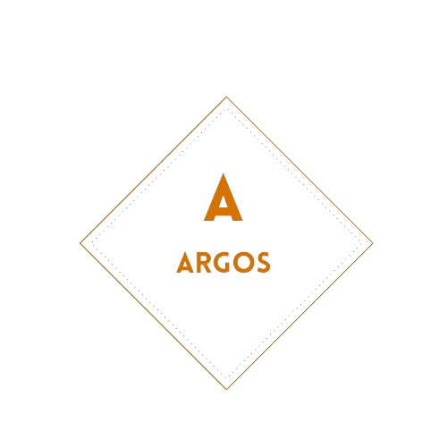

	

# Argos — Plateforme de lecture de mangas en ligne

Bienvenue sur **Argos**, une application web moderne permettant de **lire, découvrir et suivre des mangas** en ligne.  
Développé avec **Next.js (App Router)**, **TypeScript** et **Tailwind CSS**, Argos met l'accent sur la performance, l'expérience utilisateur et une architecture claire pour l'apprentissage et la scalabilité.

---

## 🚀 Fonctionnalités principales

- 📖 **Lecture de mangas en ligne** (chapitres, pagination, lecteur fluide)
- 🔍 **Recherche et filtrage** de mangas
- ❤️ **Gestion des favoris** (ajout / suppression)
- 👤 **Espace utilisateur** (connexion, profil, historique)
- 🌙 **Mode clair / sombre**
- 🧭 **Navigation dynamique** selon les routes et l’état utilisateur
- 🔒 **Authentification sécurisée** avec [NextAuth.js](https://next-auth.js.org/)
- 🧠 **Architecture modulaire et typée** (TypeScript + custom hooks)
- ⚡ **Intégration d’API externe** pour récupérer les données de mangas (Jikan / MangaDex)

---

## 🧱 Architecture du projet

## 🧑‍💻 Auteur

👤 **Sadibou Cissé**

Projet créé dans le but d’apprendre et de maîtriser Next.js, TypeScript et la structure d’un vrai projet web moderne.

📬 Contact : [sadiboucisse.dev@gmail.com]